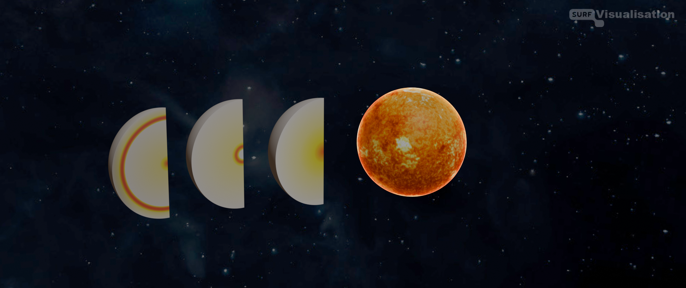
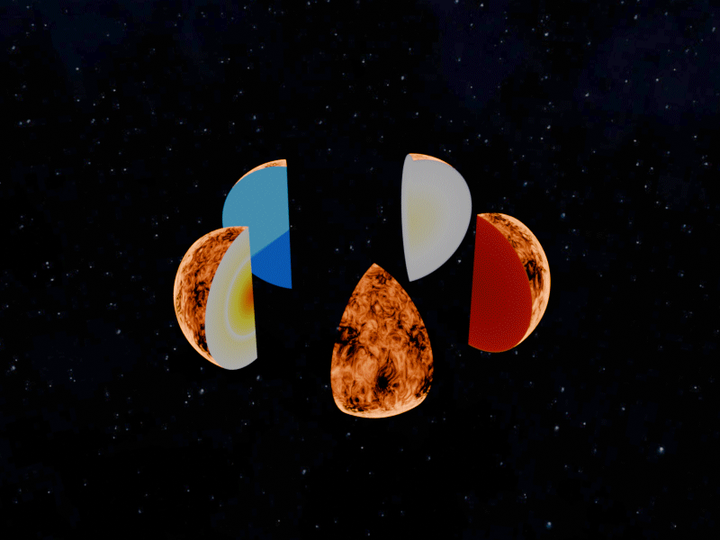

## Authors
<a href="https://evalaplace.github.io/tools/tulips/" target="_blank">Eva Laplace</a>

Professor in astrophysics at KU Leuven and Veni fellow at the University of Amsterdam.
Author of the original [Tulips](https://evalaplace.github.io/tools/tulips/) visualisation software.

<a href="https://www.linkedin.com/in/bldevries/" target="_blank">BL de Vries</a>

PhD in astrophysics & Graphics Engineer at <a href="https://www.surf.nl" target="_blank">SURF</a>.
Programmer of the Tulips3D Blender addon.

## Introduction
Tulips3D, built upon [Tulips](https://evalaplace.github.io/tools/tulips/), is a Blender addon that visualizes stellar evolution in 3D.

## Some first simple examples
A still render of energy production in a star at three different moment of evolution.

An animation of showing the star's interior properties.

Animation of how the different interior properties of the star change over time.

<!-- 
A rendered animation of three internal properties of the star as function of time. You see energy production, log(T) and log(rho).

 -->
## Installation
For the moment, use [these](tutorials/a_first_installation_and_test.md) instructions to install and test Tulips3D.
